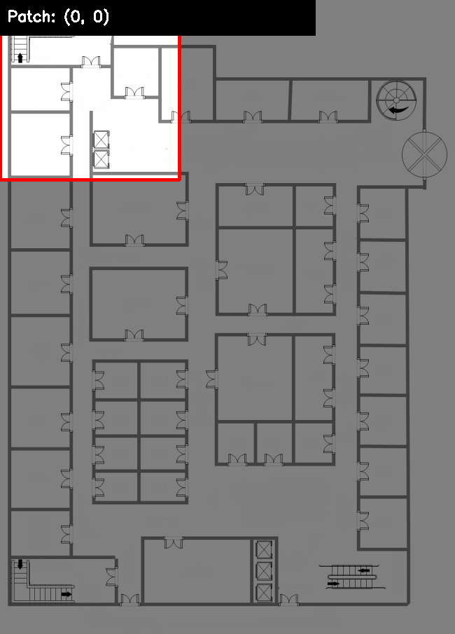
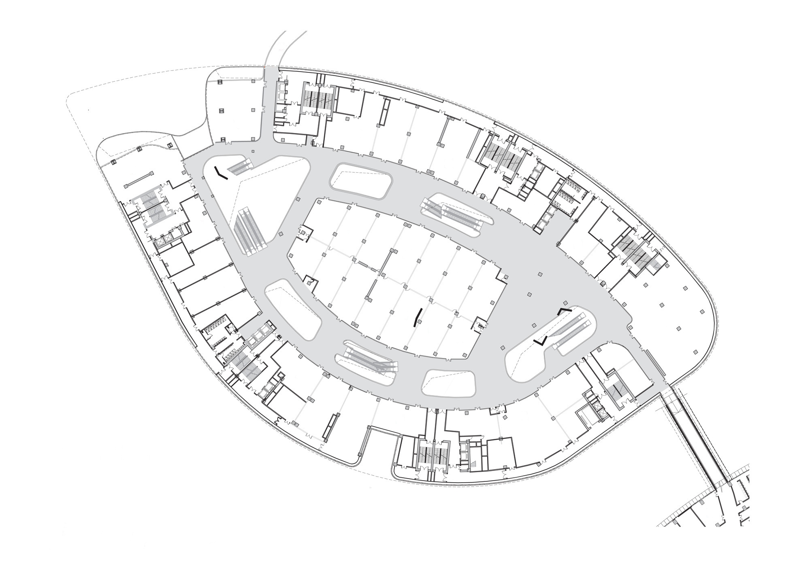
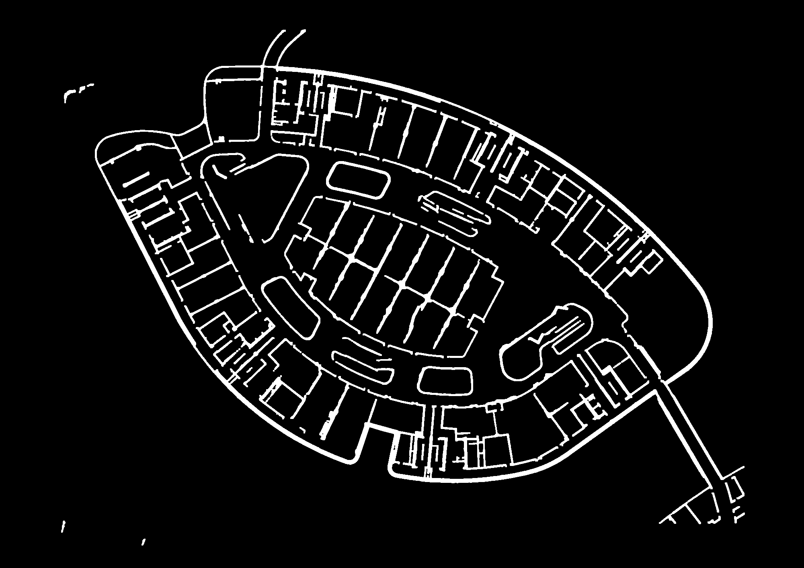
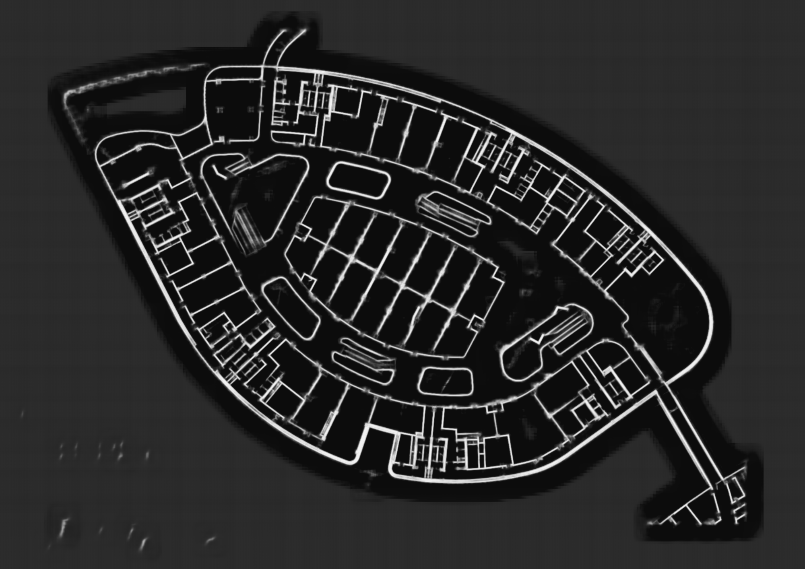

# S.T.I.T.C.H
### Segmentation & Tiled Inference for Topological Chart Handling

> Floorplan wall segmentation using UNet — built to feed structural data into **[T.R.A.G.I.C](https://github.com/sankhya007/T.R.A.G.I.C-Crowd-Evac)**, a real-time crowd evacuation simulation system.

---

## What This Does

You give it a floorplan image. It gives you back a binary mask — walls white, walkable space black. Clean, fast, and accurate enough to drive a simulation.

That mask feeds directly into T.R.A.G.I.C, where agents navigate the parsed layout in real time during evacuation scenarios.

No manual annotation. No CAD software. Just a floorplan image and a trained model.

---

## Why It Exists

Evacuation simulations need accurate spatial maps. Getting those maps from raw architectural drawings is a pain — especially when the drawings have diagonal walls, rotated layouts, or non-standard structure.

S.T.I.T.C.H solves that. It parses the floorplan automatically and hands off a usable wall mask to the simulation layer.

---

## Repo Contents

| File | What it is |
|---|---|
| `model.py` | UNet architecture definition (custom, used by `train.py`) |
| `train.py` | Training loop — run this to train from scratch |
| `predict.py` | Single image inference (quick test, no tiling) |
| `predict_tiled.py` | Tiled inference — standard weights, no TTA |
| `predict_tiled_tta.py` | Tiled inference — TTA weights, slower but more accurate |
| `dataset.py` | PyTorch dataset loader |
| `convert_cubicasa.py` | Converts CubiCasa5K COCO annotations → binary masks |
| `convert_msd.py` | Converts MSD `.npy` files → binary masks |
| `training_combined.ipynb` | Ready-to-run Google Colab notebook for training on GPU |
| `diagram_stitch.py` | Generates the stitching visualization GIF |

---

## Downloads

Everything you need is hosted externally — the repo stays lightweight.

### Trained Model Weights

Two sets of weights are available. Both are on HuggingFace — download whichever you want to test.

🔗 **[Download from HuggingFace](https://huggingface.co/sankhya007/Floorplan_parser_STITCH/tree/main)**

| File | Script to use | Notes |
|---|---|---|
| `unet.pth` | `predict_tiled.py` | Standard weights, faster inference |
| `unet_tta.pth` | `predict_tiled_tta.py` | TTA weights, slower but smoother output |

Place the downloaded `.pth` file(s) in the project root before running any predict script.

If you're just testing, start with `unet.pth` + `predict_tiled.py`. Switch to the TTA version if you need cleaner results on a specific image.

---

### Dataset

The fully converted and merged training dataset (~10,000 images + masks) from both CubiCasa5K and Modified Swiss Dwellings, preprocessed and ready to train on directly.

🔗 **[Download dataset.zip from HuggingFace](https://huggingface.co/sankhya007/Floorplan_parser_STITCH/tree/main)**

Unzip it into the project root so the structure looks like:
```
S.T.I.T.C.H/
├── dataset/
│   ├── images/
│   └── masks/
```

---

### Training Notebook

If you want to retrain on Google Colab (free T4 GPU), the notebook is in the repo as `training_combined.ipynb`. It handles everything — mounts Drive, unzips dataset, trains, saves weights back to Drive.

Steps:
1. Upload `dataset.zip` to your Google Drive root
2. Open `training_combined.ipynb` in Google Colab
3. Set runtime to **T4 GPU** (Runtime → Change runtime type)
4. Run cells top to bottom
5. Weights auto-save to your Drive when done

---

## Quickstart — Run Inference

```bash
git clone https://github.com/sankhya007/S.T.I.T.C.H
cd S.T.I.T.C.H
python3 -m venv venv
source venv/bin/activate
pip install -r requirements.txt
```

Download the weights from HuggingFace and place them in the root, then pick your script:

**Quick single image test:**
```bash
python predict.py
# output → prediction.png
```

**Standard tiled inference (recommended starting point):**
```bash
python predict_tiled.py --image path/to/floorplan.jpg --model unet.pth
# output → stitched_mask.png + debug_raw_mask.png
```

**TTA tiled inference (slower, smoother):**
```bash
python predict_tiled_tta.py --image path/to/floorplan.jpg --model unet_tta.pth
# output → stitched_mask.png + debug_raw_mask.png
```

Optional flags (same for both tiled scripts):
```bash
--stride 128    # lower = more overlap = smoother but slower
--output result.png
```

---

## Quickstart — Train From Scratch

1. Download `dataset.zip` from HuggingFace and unzip into project root
2. Or build your own dataset by running the converters:
```bash
python convert_cubicasa.py   # needs CubiCasa5K in used_datasets/cubicasa5k/
python convert_msd.py        # needs MSD in used_datasets/msd/
```
3. Then train:
```bash
python train.py
```
Or use `training_combined.ipynb` on Google Colab for GPU training.

---

## How Tiled Inference Works

Large floorplans can't just be resized — you lose detail and break walls. Instead:

```
Input Image
    ↓
Add ~5% reflective padding
    ↓
Sliding window (256×256 patches, 50% overlap)
    ↓
UNet inference on each patch
    ↓
Gaussian-weighted blending (center = high confidence, edges = low)
    ↓
Remove padding
    ↓
Binary mask — walls white, walkable space black
```

The Gaussian blending eliminates seams and broken edges at patch boundaries.

**TTA (Test-Time Augmentation)** runs each patch four times with different flip orientations and averages the predictions. This reduces noise and produces cleaner wall outlines at the cost of ~4x inference time.

<p align="center">
  
</p>

---

## Model & Training Details

| | |
|---|---|
| Architecture | UNet with ResNet34 encoder (pretrained on ImageNet) |
| Library | segmentation-models-pytorch |
| Input size | 256×256 RGB |
| Output | Binary mask (walls=white, space=black) |
| Loss | 0.5 × BCEWithLogitsLoss (pos_weight=3.0) + 0.5 × Dice |
| Optimizer | Adam (lr=1e-4) |
| Scheduler | ReduceLROnPlateau (patience=2, factor=0.5) |
| Batch size | 4 |
| Epochs | 15 |
| Training images | ~10,000 |
| Trained on | Google Colab T4 GPU |

---

## Training Data

Trained on two datasets merged together:

**CubiCasa5K** — ~5,000 annotated residential floorplans (COCO format). Doors are removed from masks to create walkable gaps.
→ https://github.com/CubiCasa/CubiCasa5k

**Modified Swiss Dwellings (MSD)** — ~5,000+ multi-unit Swiss building floorplans. Covers diagonal walls and complex rotated layouts that CubiCasa doesn't have.
→ https://github.com/caspervanengelenburg/msd

---

## Results

| Original Floorplan | Parsed Wall Mask |
|---|---|
|  |  |

<p align="center">
  <br>
  <em>Raw probability map before thresholding</em>
</p>

---

## Part Of

S.T.I.T.C.H is the perception layer of a larger system:

**[T.R.A.G.I.C — Crowd Evacuation Simulation](https://github.com/sankhya007/T.R.A.G.I.C-Crowd-Evac)**
Real-time agent-based evacuation simulation that uses the wall masks from this model to define navigable space and run crowd flow analysis.

---

## Requirements

- Python 3.10+
- PyTorch
- segmentation-models-pytorch
- OpenCV
- NumPy
- tqdm
- pycocotools *(dataset conversion only)*

```bash
pip install -r requirements.txt
```

---

## Limitations

S.T.I.T.C.H is trained on structural elements only and performs best on clean line-drawing floorplans. The following are known hard limits of the current model:

**Text annotations detected as walls**
Room labels, dimension text, and area callouts are partially detected as wall fragments. Small scattered blobs are filtered out in post-processing but text that runs parallel to a wall or merges with a nearby wall prediction is indistinguishable from a real wall segment at the patch level. This cannot be fully resolved without a dedicated text-detection suppression layer.

**Crowd flow arrows detected as walls**
Architectural drawings often include directional arrows indicating crowd flow or exit routes. These are thin and elongated, which means they pass the same geometric filters that keep real walls. Post-processing reduces this but does not eliminate it entirely.

**Furniture noise in dense floorplans**
Tables, chairs, bathtubs, and similar symbols produce false positive detections, especially when drawn touching or close to walls. The model has no concept of furniture vs structure. Hard negative training reduces this but does not fully solve it — furniture in dense, annotation-heavy drawings will still produce noise.

**Narrow passages don't parse well**
When the target floorplan has narrow passages or corridors where the walls are too close together, there is a tendency for that passage to not appear as a clear gap in the binary mask. The model reads it as a thick wall and fills it in.

**Not trained on non-residential layouts**
Industrial buildings, warehouses, stadiums, and irregular architectural styles are outside the training distribution and will produce degraded results.

---

## License

MIT — use it, build on it, give credit if it helped.

---

## Author

**Sankhyapriyo Dey**
Building tools that will make my job obsolete.